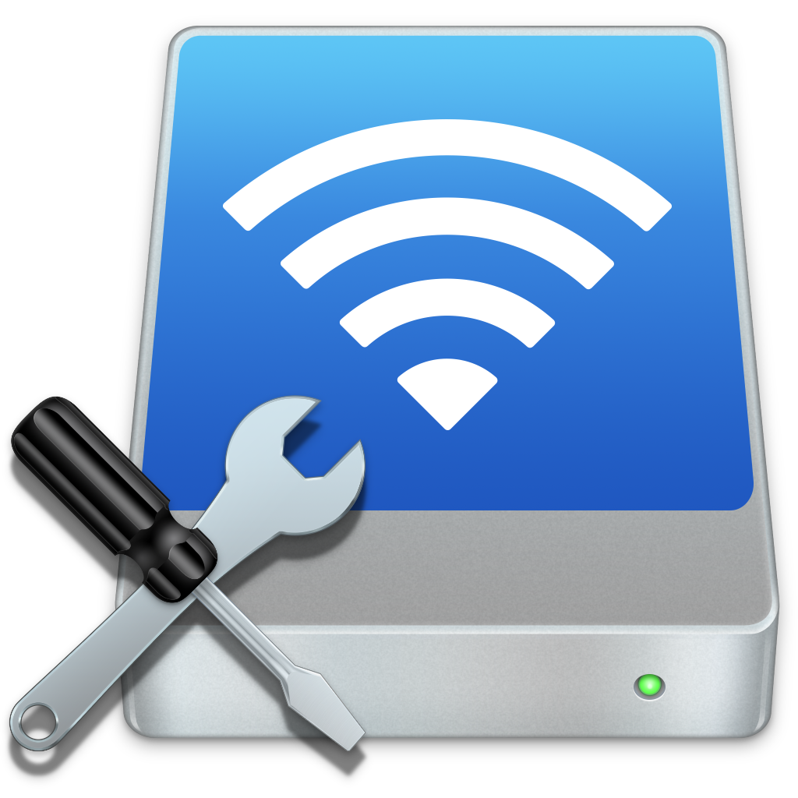
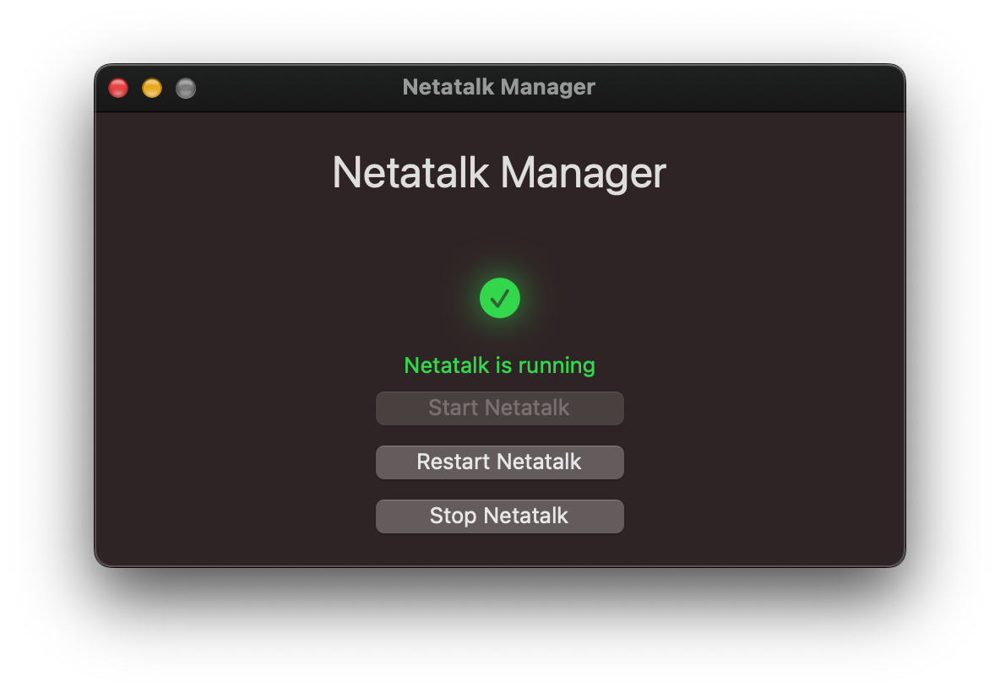
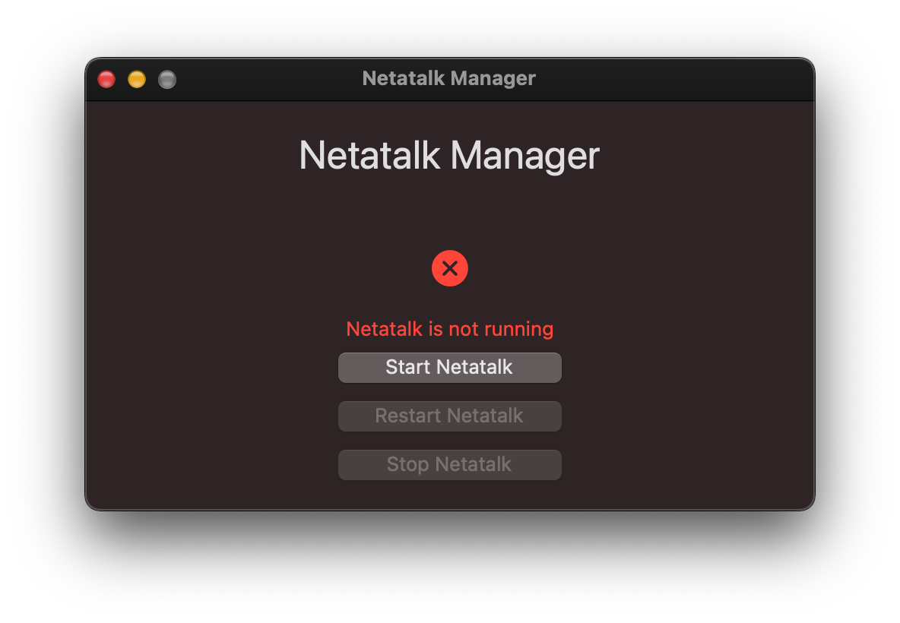

<p align="center">
  
</p>

<h1 align="center">Netatalk Manager</h1>

<p align="center">
  A beautiful, native macOS app to manage your Netatalk service with one click.
</p>

<p align="center">
  <a href="https://github.com/victorlobe/Netatalk-Manager/releases/latest">
    
  </a>
  
  
  
</p>

---

## ✨ Features

- 💡 Start, stop, and restart Netatalk via `brew services`
- 🔄 Live status updates with animation and glow
- 🟢/🔴 Optional Dock badge indicator
- 🧽 Native macOS layout and non-resizable UI
- 🧃 No terminal needed

---

## 📦 Download

👉 [**Download the latest version (.dmg)**](https://github.com/yourusername/netatalk-manager/releases/latest)

> **Requirements:**
> - macOS 11 or later
> - [Netatalk](https://netatalk.sourceforge.io/) installed via Homebrew:
>
> ```bash
> brew install netatalk
> ```

---

## 🖼️ Screenshots

### ✅ Netatalk is running


### 🔴 Netatalk is not running


---

## ⚙️ Preferences

- Toggle Dock badge visibility from the **View** menu

---

## 🔧 How It Works

Netatalk Manager uses `brew services` under the hood to control your Netatalk installation.  
It checks status using both `brew services list` and `pgrep`, with graceful fallback.

The UI is built entirely in **Swift + Cocoa**, optimized for clarity and speed.

---

## 🧑‍💻 License

This project is licensed under the [MIT License](LICENSE).

---

## 🧠 Author

Made with ❤️ by [Victor Lobe](https://github.com/victorlobe)